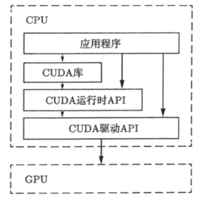
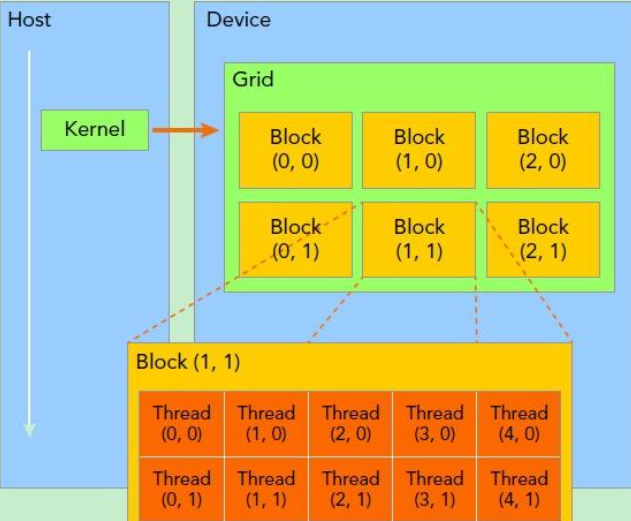

# cuda
### GPU编程简介
CUDA开发主要是是以主机（CPU）为出发点的应用程序可以调用CUDA运行时API、CUDA驱动API及一些已有的CUDA库。所有这些调用都将利用设备（GPU）的硬件资源。



### 开发环境搭建

win11环境下

VS2022

CUDA（需要cuda studio integration）

CUDNN（深度学习加速）

测试是否安装成功

```shell
nvcc -V
```

查看显卡信息

```shell
nvidia-smi
```

### CUDA开发流程

```c++
int main(viod)
{
    主机代码
    核函数调用
    主机代码
    returen
}
```

CUDA中的核函数与C＋＋中的函数是类似的，但＿个显著的差别是它必须 被限定词global修饰。其中global前后是双下划线。另外核 函数的返回类型必须是空类型。限定符global和void的次序可随意。

```C++
__global__ void hello() {
	printf("Hello World from GPU!\n");
}
```

调用核函数

```c++
#helloworld.cu
#include<stdio.h>

void __global__  hello() {
	printf("Hello World from GPU!\n");
}
int main() {
	// Launch kernel on GPU
	hello << <1, 5 >> > ();
	// Wait for GPU to finish before accessing on host
	cudaDeviceSynchronize();
	return 0;
}
```

主机在调用一个核函数时必须指明需要在设备中指派多少个线程，否则设备不知道如何工作。三括号中的数就是用来指明核函数中的线程数目及排列情况的。<<<grid_size,block_size>>>

#### 网格，线程块，线程



由一个内核启动所产生的所有线程统称一个**网格**（Grid），**同一网格中的所有线程共享相同的全局内存空间**。

一个网格由多个**线程块**（Block）构成。一个线程块由**一组线程**（Thread）构成。线程网格和线程块从逻辑上代表了一个核函数的线程层次结构，这种组织方式可以帮助我们有效地利用资源，优化性能。CUDA编程中，我们可以组织三维的线程网格和线程块，具体如何组织，一般是和我们需要处理的数据有关。上面这个示意图展示的是一个包含二维线程块的二维线程网格。


#### 线程数

可以为一个核函数指派多个线程，而这些线程的组织结构由执行配置决定

```c++
<<<grid_size,block_size>>>
```

这里的grid_size（网格大小）和block_size（线程块大小）一般来说是一个结构体类型的变量，但也可以是—个普通的整型变量，这两个整型变量的乘积就是被调用核函数中总的线程数。

一般来说只要线程数比GPU中的计算核心数（几百至几千 个）多几倍时就有可能充分地利用GPU中的全部计算资源。

每个线程在核函数中都有一个唯一的身份标识。由于我们用两个参数指定了线程数目，每个线程的身份可由两个参数确定，在核函数内部，程序是知道执行配置参数grid_size和block_size的值的，这两个值分别保存于gridDim.x和blockDim.x中，如果网格和线程块是二维或三维，则还有.y和.z参数

#### CUDA中的头文件

在编写 C++程序时，往往需要在源文件中包含一些标准的头文件。本章程序包含C++的头文件<stdio.h>，但并没有包含任何 CUDA 相关的头文件。CUDA 中也有一些头文件，但是在使用nvcc编译器驱动编译.cu 文件时，将自动包含必要的CUDA 头文件，如<cuda.h>和<cuda_runtime.h>。因为<cuda.h>包含<stdlib.h>，故用 nvcc 编译 CUDA 程序时甚至不需要在.cu文件中包含<stdlib.h>。当然，用户依然可以在.cu 文件中包含<stdlib.h>，因为(正确编写的)头文件不会在一个编译单元内被包含多次。

#### nvcc编译cuda程序

CUDA 的编译器驱动(compiler driver)nvcc 先将全部源代码分离为主机代码和设备代码。主机代码完整地支持 C++语法,但设备代码只部分地支持 C++。nvcc先将设备代码编译为 PTX(parallel thread execution)伪汇编代码，再将 PTX 代码编译为二进制的 cubin 目标代码。在将源代码编译为 PTX 代码时，需要用选项

```shell
 -arch=compute_XY
```

指定一个虚拟架构的计算能力，用以确定代码中能够使用的CUDA 功能。在将PTX 代码编译为 cubin 代码时，需要用选项

```shell
 -code=sm_zw 
```

指定一个真实架构的计算能力，用以确定可执行文件能够使用的 GPU。真实架构的计算能力必须等于或者大于虚拟架构的计算能力。例如，可以用选项

```shell
 -arch=compute_35   -code=sm_60
```

如果仅仅针对一个 GPU编译程序,一般情况下建议将以上两个计算能力都选为所用 GPU 的计算能力。
用以上的方式编译出来的可执行文件只能在少数几个 GPU 中才能运行。选项-code=sm_zw指定了 GPU 的真实架构为 Z.W。对应的可执行文件只能在主版本号为Z次版本号大于或等于W的GPU 中运行。举例来说，由编译选项

```shell
-arch=compute_35-code-sm_35
```

编译出来的可执行文件只能在计算能力为3.5和3.7的 GPU 中执行，而由编译选项

```shell
-arch=compute_35-code=sm_60
```

编译出来的可执行文件只能在所有帕斯卡架构的 GPU 中执行。

如果希望编译出来的可执行文件能够在更多的 GPU 中执行，可以同时指定多组计算能力，每一组用如下形式的编译选项:
-gencode arch=compute_XY,code=sm_ZW

例如，用选项

```shell
-gencode arch=compute_35,code=sm_35
-gencode arch=compute_50,code=sm_50
-gencode arch=compute_60,code=sm_60
-gencode arch=compute_70,code=sm_70
```

编译出来的可执行文件将包含4个二进制版本，分别对应开普勒架构(不包含比较老的 3.0 和 3.2 的计算能力)、麦克斯韦架构、帕斯卡架构和伏特架构。这样的可执行文件称为胖二进制文件(fatbinary)。在不同架构的 GPU 中运行时会自动选择对应的二进制版本。需要注意的是，上述编译选项假定所使用的CUDA 版本支持7.0的计算能力，也就是说，至少是CUDA 9.0。如果在编译选项中指定了不被支持的计算能力，编译器会报错。另外，需要注意的是，过多地指定计算能力，会增加编译时间和可执行文件的大小。
nvcc 有一种称为即时编译(just-in-time compilation)的机制，可以在运行可执行文件时从其中保留的 PTX代码临时编译出一个cubin 目标代码。要在可执行文件中保留(或者说嵌入)一个这样的 PTX代码，就必须用如下方式指定所保留PTX 代码的虚拟架构:
-gencode arch=compute_XY,code=compute_XY

这里的两个计算能力都是虚拟架构的计算能力，必须完全一致。例如，假如我们处于只有CUDA 8.0的年代(不支持伏特架构)，但希望编译出的二进制版本适用于尽可能多的 GPU，则可以用如下的编译选项:

```shell
-gencode arch=compute_35,code=sm_35
-gencode arch=compute_50,code=sm_50
-gencode arch=compute_60,code=sm_60
-gencode arch=compute_60,code=compute_60
```

其中，前3行的选项分别对应3个真实架构的cubin 目标代码，第四行的选项对应保留的 PTX 代码。这样编译出来的可执行文件可以直接在伏特架构的 GPU中运行，只不过不一定能充分利用伏特架构的硬件功能。在伏特架构的GPU 中运行时，会根据虚拟架构为6.0的PTX代码即时地编译出一个适用于当前 GPU的目标代码。
在学习 CUDA 编程时，有一个简化的编译选项可以使用:

```shell
-arch=sm_XY
```

它等价于

```shell
gencode arch=compute_XY,code=sm_XYgencode arch=compute_XY,code=compute_XY
```

本章的程序在编译时并没有通过编译选项指定计算能力。这是因为编译器有一个默认的计算能力。以下是各个 CUDA 版本中的编译器在编译 CUDA 代码时默认的计算能力。

(1)CUDA 6.0 及更早的:默认的计算能力是 1.0。
(2)CUDA 6.5~CUDA 8.0:默认的计算能力是 2.0。
(3)CUDA 9.0~CUDA 10.2:默认的计算能力是 3.0。

### CUDA程序开发框架

数组相加

以下是一个C++程序的数组相加代码(.cpp)

```c++
#include <math.h>
#include <stdlib.h>
#include <stdio.h>

double EPSILON = 1.0e-15;

const double a = 1.23;
const double b = 2.34;
const double c = 3.57;

void add(const double *x,const double *y, double *z, const int N);
void check(const double *z，const int N);

int main(void){
    Const int N = 100000000:
	Const int M = sizeof(double)*N;
    
	double *x = (double*)ma110c(M);
	double *y = (double*)mal1oc(M);
	double *z = (double*)malloc(M);
    
	for(int n=0;n<H;++n){
        x[n]= a;
		y[n]=b;
    }
		
    add(x,y,z,N);
	check(z,N);
	free(x);
    free(y);
    free(z);
    return 0;
}

void add(const double *x,const double *y, double *z, const int N){
    for(int n=0;n<N;++n){
        z[n]= x[n]+ y[n];
	}
		
}

void check(const double *z，const int N){
    bool has_error = false;
    for(int n=0; n<N; ++n)
	if(fabs(z[n]-c) > EPSILON){
        has_error = true;
    }
		
	printf("%s\n",has_error ?"Has errors" :"No errors");
}

```

#### CUDA程序的基本框架

```C++
头文件包含
常量定义(或者宏定义)
C++自定义函数和CUDA核函数的声明(原型)
int main(void){
	分配主机与设备内存
    初始化主机中的数据
    将某些数据从主机复制到设备
    调用核函数在设备中进行计算
    将某些数据从设备复制到主机
    释放主机与设备内存
}
自定义函数和CUDA 核函数的定义(实现)
```

用cuda实现的数组相加(.cu)

```c++
#include <math.h>
#include <stdio.h>

double EPSILON = 1.0e-15;

const double a = 1.23;
const double b = 2.34;
const double c = 3.57;

void __global__ add(const double *x,const double *y, double *z, const int N);

void check(const double *z，const int N);

int main(void){
    Const int N = 100000000:
	Const int M = sizeof(double)*N;
    
	double *h_x = (double*)ma110c(M);
	double *h_y = (double*)mal1oc(M);
	double *h_z = (double*)malloc(M);
    
	for(int n=0;n<H;++n){
        h_x[n]= a;
		H_y[n]=b;
    }
		
    
    double *d_x, *d_y, *d_z;
    
    cudaMalloc((void **)&d_x，M);
    cudaMalloc((void **)&d_y，M);
    cudaMalloc((void **)&d_z，M);
    
	cudaMemcpy(d_x, h_x, M, cudaMemcpyHostToDevice);
    cudaMemcpy(d_y, h_y, M, cudaMemcpyHostToDevice);
    
	const int block_size128;
    const int grid_size=N/block_size;
    
    add<<<grid_size,block_size>>>(d_x，d_y，d_z);
    
	cudaMemcpy(h_z, d_z, M, cudaMencpyDeviceToHost);
    check(h_z，N);
    
	free(h_x);
    free(h_y);
    free(h_z);
    
    cudaFree(d_x);
    cudaFree(d_y);
    cudaFree(d_z);
    
    return 0;
}

void __global__ add(const double *x,const double *y, double *z){
    const int n= blockDim.x * blockIdx.x + threadIdx.x;
    z[n]= x[n]+ y[n];
}


```

用 nvcc编译该程序，并指定与显卡对应的计算能力(可以选用自己所用 GPU 的计算能力):

```shell
nvcc -arch=sm_75 add1.cu
```

将得到一个可执行文件 a.out。运行该程序得到的输出应该与前面 C++ 程序所得到的输出一样，说明得到了预期的结果。
值得注意的是，当使用较大的数据量时，网格大小往往很大。例如，本例中的网格大小为108/128=781250。如果使用CUDA 

8.0，而在用 nvcc 编译程序时又忘了指定一个计算能力，那就会根据默认的2.0的计算能力编译程序。对于该计算能力，网格大小在x方向的上限为65535，小于本例中所使用的值。这将导致程序无法正确地执行。
